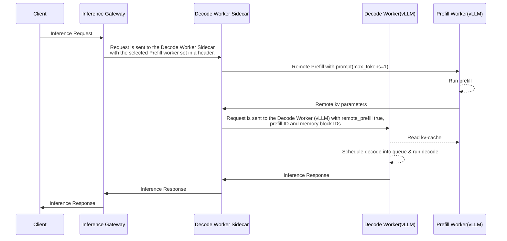
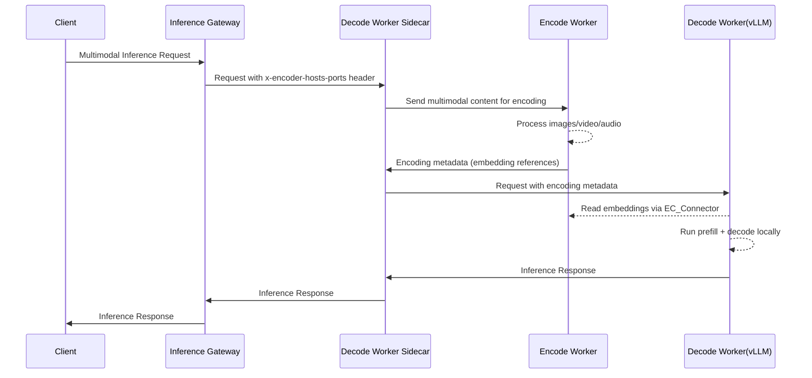
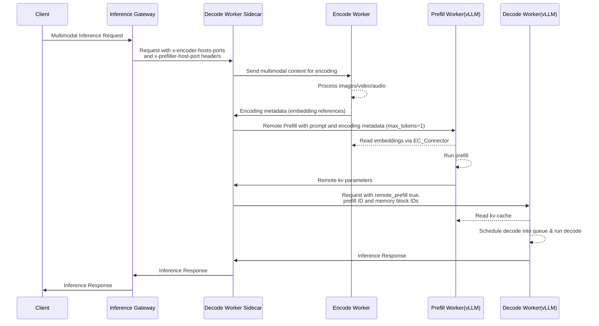

# Disaggregated Inference Serving in llm-d

## Overview

This document describes the architecture and request lifecycle for enabling **disaggregated inference execution** in the llm-d Router. llm-d supports multiple disaggregation topologies:

- **EPD** (no disaggregation) – a single node handles all three functions (encode, prefill, and decode). This is the default mode when no disaggregation is configured.
- **P/D** (Prefill/Decode) – separates the prefill and decode stages onto different workers. This is functionally equivalent to EP/D, since prefill workers also handle encoding (multimodal processing) as part of the prefill stage.
- **E/PD** (Encode/Prefill-Decode) – offloads multimodal encoding to dedicated workers while a single worker handles prefill and decode.
- **E/P/D** (Encode/Prefill/Decode) – the full three-stage pipeline where each stage runs on a specialized worker.

> [!NOTE] 
> The Encode (E) stage is only relevant for requests with multimodal content (images, video, or audio). For text-only requests, the encode stage is skipped regardless of the configured topology.

> [!WARNING]
> Encode disaggregation (E/PD and E/P/D) is under active development in both vLLM and llm-d-router.
> The implementation described here is a proof of concept (PoC) and is subject to change.

All topologies are driven by the unified `disagg-profile-handler` plugin, which selects active stages based on configuration, the user request (e.g., presence of multimodal content), and the system status (e.g., KV-cache hit ratio on the selected decode pod). The architecture aims to improve flexibility, scalability, and performance by enabling separation of inference stages onto different workers.

---

## Goals

- Enable routing of encode, prefill, and decode to different workers
- Maintain low latency and high throughput
- Improve resource utilization by specializing pods for each stage
- Support multimodal workloads by offloading encoding to dedicated workers
- Align with GIE-compatible architectures for potential upstreaming

---

## Key Components

| Component            | Role                                                                         |
|----------------------|------------------------------------------------------------------------------|
| **Encode Worker**    | Handles multimodal encoding (images, video, audio) for E/PD and E/P/D       |
| **Prefill Worker**   | Handles prefill stage using vLLM engine; in EP/D configuration, also handles encoding for multimodal requests |
| **Decode Worker**    | Handles decode stage and contains the sidecar for coordination               |
| **Sidecar (Decode)** | Orchestrates communication with encode/prefill workers and manages lifecycle |
| **Envoy Proxy**      | Accepts OpenAI-style requests and forwards them to EPP                       |
| **EPP**              | Endpoint Picker, makes scheduling decisions                                  |

---

## Request Lifecycle

### P/D (Prefill/Decode)

1. **User Request** – Sent via OpenAI API to the Envoy Proxy
2. **EPP Scheduling Decision** – The `disagg-profile-handler` runs stages in order:
   1. **Decode**: always runs first, selects a decode pod
   2. **Prefill** (optional): the PD decider evaluates prompt length and prefix-cache hit; if disaggregation is warranted, a prefill pod is selected
3. **Execution** – Request lands on Decode Worker:
   - If `x-prefiller-host-port` header doesn't exist → runs both stages locally
   - If `x-prefiller-host-port` header exists → sidecar sends prefill to the selected Prefill Worker, then runs decode locally
4. **Response Flow** – decode sidecar → Envoy → EPP → User

### E/PD (Encode/Prefill-Decode)

For multimodal requests (images, video, audio), the encode stage can be disaggregated to dedicated workers:

1. **User Request** – Multimodal request sent via OpenAI API
2. **EPP Scheduling Decision** – The `disagg-profile-handler` runs stages in order:
   1. **Decode**: selects a decode pod
   2. **Encode** (optional): the encode decider checks for multimodal content; if present, an encode pod is selected
3. **Execution** – Request lands on Decode Worker:
   - If encode was scheduled → sidecar sends encoding work to the selected Encode Worker(s) via the `x-encoder-hosts-ports` header
   - Encode Worker processes multimodal content and returns encoding metadata (embedding references)
   - Decode Worker reads embeddings via EC_Connector and runs prefill + decode locally
4. **Response Flow** – decode sidecar → Envoy → EPP → User

### E/P/D (Encode/Prefill/Decode)

The full three-stage pipeline combines both encode and prefill disaggregation:

1. **User Request** – Multimodal request sent via OpenAI API
2. **EPP Scheduling Decision** – The `disagg-profile-handler` runs all three stages in order:
   1. **Decode**: selects a decode pod
   2. **Encode** (optional): if multimodal content is detected, an encode pod is selected
   3. **Prefill** (optional): if the PD decider determines disaggregation is beneficial, a prefill pod is selected
3. **Execution** – Request lands on Decode Worker:
   - If encode was scheduled → sidecar sends encoding work to the selected Encode Worker(s) via the `x-encoder-hosts-ports` header
   - Encode Worker processes multimodal content and returns encoding metadata (embedding references)
   - If prefill was scheduled → sidecar sends prefill to Prefill Worker via the `x-prefiller-host-port` header
   - Prefill Worker reads embeddings via EC_Connector and executes prefill operation
   - Decode Worker runs decode locally
4. **Response Flow** – decode sidecar → Envoy → EPP → User

---

## Architectural Details

### P/D Sequence



### E/PD Sequence



### E/P/D Sequence



### Sidecar Responsibilities (Decode Only)

- Receives EPP metadata (decode pod, optional encode pod(s), optional prefill pod)
- If encode endpoints are present, sends multimodal content to Encode Worker(s), waits for results and validates them
- If prefill endpoint is present, sends prefill request to Prefill Worker, waits for results and validates them
- Launches local decode job
- Sends final response

> [!NOTE]
> No sidecar or coordination logic is needed on the prefill or encode nodes.

---

## Worker Selection Logic

- **Decode Worker**: Prefer longest prefix match / kv-cache utilization (depends on available scorers) and low load
- **Prefill Worker**: Same scoring criteria as decode
- **Encode Worker**: Selected when multimodal content is detected in the request

> **Skip prefill** when:
> - Prefix match / kv-cache hit is high
> - Prompt is very short

> **Skip encode** when:
> - Request contains no multimodal content (text-only)
> - Encode decider rejects the request

---


## Drawbacks & Limitations

- Slight increase in TTFT for disaggregated P/D and E/P/D
- Additional network hops for E/P/D (encode → prefill → decode)
- Possibility of stranded memory on prefill crash
- The need for timeout and retry logic

---

## Design Benefits

- **Flexibility**: Enables per-request specialization and resource balancing
- **Scalability**: Clean separation of concerns for easier ops and tuning
- **Upstream-ready**: Follows GIE-compatible request handling
- **Minimal Changes**: Only decode node includes orchestration sidecar

---

## Future Considerations

- Cache coordination (we can talk about 3 different types of cache: KV-cache, embeddings, and multimedia content)
- Pre-allocation of kv blocks in the decode node, push cache from the prefill to the decode worker during calculation
- More sophisticated encode worker selection (e.g., load-aware scheduling, cache content, locality-aware placement)

---

## Integrating External Prefill/Decode Workloads

The llm-d Router supports integration with external disaggregated encode/prefill/decode (E/P/D) workloads or other inference frameworks that follow the same E/P/D separation pattern but use **different Kubernetes Pod labeling conventions**.

### Labeling Convention Flexibility

By default, llm-d uses the label key `llm-d.ai/role` with values:
- `"encode"` → encode-only pods (multimodal encoding)
- `"prefill"` → prefill-only pods
- `"decode"` → decode-capable pods
- `"encode-prefill"` → pods capable of both encode and prefill (EP/D or P/D)
- `"encode-decode"` → pods capable of both encode and decode (E/PD, rare)
- `"prefill-decode"` → pods capable of both prefill and decode
- `"encode-prefill-decode"` → pods capable of all three stages
- `"both"` → **deprecated** (use `"prefill-decode"` instead)

However, external systems may use alternative labels like:
```yaml
role: encode
role: prefill
role: decode
```

To accommodate this **without code changes**, you can configure the **EndpointPickerConfig** to use the generic `label-selector-filter` plugin instead of the hardcoded `encode-filter` / `prefill-filter` / `decode-filter`.

> [!NOTE]
> The previous filter type `by-label` is deprecated. Use `label-selector-filter` with standard Kubernetes label selector syntax instead.

### Configuration Examples

#### P/D Configuration

Below is a minimal `EndpointPickerConfig` for P/D disaggregation using custom labels:

```yaml
apiVersion: llm-d.ai/v1alpha1
kind: EndpointPickerConfig
plugins:
  # Prefill selection: match Pods with label role=prefill
  - type: label-selector-filter
    name: "prefill-pods"
    parameters:
      matchExpressions:
        - key: "role"
          operator: In
          values: ["prefill"]
  # Decode selection: match Pods with label role=decode
  - type: label-selector-filter
    name: "decode-pods"
    parameters:
      matchExpressions:
        - key: "role"
          operator: In
          values: ["decode"]
  - type: prefix-cache-scorer
    parameters:
      autoTune: false
      blockSizeTokens: 5
      maxPrefixBlocksToMatch: 256
      lruCapacityPerServer: 31250
  - type: max-score-picker
  - type: prefix-based-pd-decider
    parameters:
      nonCachedTokens: 8
      promptTokens: 0
  - type: disagg-profile-handler
    parameters:
      profiles:
        prefill: prefill
        decode: decode
      deciders:
        prefill: prefix-based-pd-decider
schedulingProfiles:
  - name: prefill
    plugins:
      - pluginRef: "prefill-pods"
      - pluginRef: "max-score-picker"
      - pluginRef: "prefix-cache-scorer"
  - name: decode
    plugins:
      - pluginRef: "decode-pods"
      - pluginRef: "max-score-picker"
      - pluginRef: "prefix-cache-scorer"
```

#### E/P/D Configuration

Below is an `EndpointPickerConfig` for full E/P/D disaggregation using custom labels:

```yaml
apiVersion: llm-d.ai/v1alpha1
kind: EndpointPickerConfig
plugins:
  # Encoding selection: match Pods with label role=encode
  - type: label-selector-filter
    name: "encode-pods"
    parameters:
      matchExpressions:
        - key: "role"
          operator: In
          values: ["encode"]
  # Prefill selection: match Pods with label role=prefill
  - type: label-selector-filter
    name: "prefill-pods"
    parameters:
      matchExpressions:
        - key: "role"
          operator: In
          values: ["prefill"]
  # Decode selection: match Pods with label role=decode
  - type: label-selector-filter
    name: "decode-pods"
    parameters:
      matchExpressions:
        - key: "role"
          operator: In
          values: ["decode"]
  - type: prefix-cache-scorer
    parameters:
      autoTune: false
      blockSizeTokens: 5
      maxPrefixBlocksToMatch: 256
      lruCapacityPerServer: 31250
  - type: max-score-picker
  - type: always-disagg-multimodal-decider
  - type: prefix-based-pd-decider
    parameters:
      nonCachedTokens: 8
      promptTokens: 0
  - type: disagg-profile-handler
    parameters:
      profiles:
        encode: encode
        prefill: prefill
        decode: decode
      deciders:
        encode: always-disagg-multimodal-decider
        prefill: prefix-based-pd-decider
schedulingProfiles:
  - name: encode
    plugins:
      - pluginRef: "encode-pods"
  - name: prefill
    plugins:
      - pluginRef: "prefill-pods"
      - pluginRef: "max-score-picker"
      - pluginRef: "prefix-cache-scorer"
  - name: decode
    plugins:
      - pluginRef: "decode-pods"
      - pluginRef: "max-score-picker"
      - pluginRef: "prefix-cache-scorer"
```

---

## Diagram


TODO: add E/P/D diagram

---
## Deciders

Deciders are handler plugins responsible for determining whether a disaggregated stage should be executed for a given request.

### PD Deciders

PD deciders determine whether prefill should be offloaded to a separate worker, based on the properties of the request prompt.

#### Prefix-Based PD Decider

The `prefix-based-pd-decider` plugin makes the disaggregation decision according to the length of the non-cached suffix of the prompt relative to tokens already cached on the selected decode pod.

**How It Works**
- Once a decode pod is selected, the decider checks how many tokens from the incoming prompt have already been sent to this pod

- If the prompt length is shorter than the configured prompt length threshold (promptTokens), the full request runs locally on the decode worker without remote prefill

- If the remaining non-cached suffix length is at least the configured threshold (nonCachedTokens), disaggregation is triggered: the prefill will run remotely on a prefill pod, and decode locally on the decode pod

- If the non-cached suffix is shorter than the threshold, the full request runs locally on the decode worker without remote prefill

**Configuration**
```yaml
- type: prefix-based-pd-decider
  parameters:
    nonCachedTokens: 8
    promptTokens: 0
```

**Parameter:**

- `nonCachedTokens`: Number of non-cached tokens that trigger disaggregation
  - If set to 0, disaggregation never occurs for any request
- `promptTokens`: Minimum prompt length in tokens before prefix-cache-based disaggregation logic is applied
  - If set to 0, the prompt-length gate is disabled
  - If set to a positive value, requests with fewer prompt tokens run locally on the decode worker without remote prefill

#### Always-Disagg PD Decider
The `always-disagg-pd-decider` is a simpler alternative used mainly for testing or benchmarking.
It always triggers disaggregation, regardless of prefix cache state or prompt characteristics.

**Configuration example:**

```yaml
- type: always-disagg-pd-decider
```

> [!NOTE]
> This plugin accepts no parameters.

It’s useful for validating end-to-end prefill/decode splitting and comparing system performance under forced disaggregation.

### Encode Deciders

Encode deciders determine whether multimodal encoding should be offloaded to dedicated encode workers.

#### Always Disagg Multimodal Decider

The `always-disagg-multimodal-decider` triggers encode disaggregation whenever the request contains multimodal content (images, video, or audio). Text-only requests are never sent to encode workers.

**Configuration example:**

```yaml
- type: always-disagg-multimodal-decider
```

> [!NOTE]
> This plugin accepts no parameters.

It checks for the presence of `image_url`, `audio_url`, `video_url`, or `input_audio` content blocks in the chat-completions request body. If any multimodal content is found, the encode stage is activated.

---

## Profile Handler Configuration

The `disagg-profile-handler` plugin is the entry point for all disaggregation topologies. Active stages are determined by which deciders are configured.

### Parameters

- `profiles` (optional): names of the scheduling profiles to use.
  - `decode` (default: `decode`)
  - `prefill` (default: `prefill`)
  - `encode` (default: `encode`)
- `deciders` (optional): decider plugins that control whether each stage runs.
  - `prefill`: enables P/D disaggregation when set.
  - `encode`: enables E disaggregation when set.

### Examples

#### Decode-only (no disaggregation)

No deciders are configured -- all requests are handled by the decode profile alone.

```yaml
- type: disagg-profile-handler
```

#### P/D (Prefill/Decode)

```yaml
- type: disagg-profile-handler
  parameters:
    deciders:
      prefill: prefix-based-pd-decider
```

Custom profile names (if your scheduling profiles are not named `decode`/`prefill`):

```yaml
- type: disagg-profile-handler
  parameters:
    profiles:
      decode: my-decode
      prefill: my-prefill
    deciders:
      prefill: prefix-based-pd-decider
```

#### E/PD (Encode/Prefill-Decode)

```yaml
- type: disagg-profile-handler
  parameters:
    deciders:
      encode: always-disagg-multimodal-decider
```

#### E/P/D (Encode/Prefill/Decode)

```yaml
- type: disagg-profile-handler
  parameters:
    deciders:
      prefill: prefix-based-pd-decider
      encode: always-disagg-multimodal-decider
```

---

## Sidecar Configuration

The decode sidecar proxy is responsible for coordinating KV cache transfers between vLLM instances during disaggregated inference. It must be configured with the correct connector protocol matching the vLLM `kv_connector` used on the serving pods.

### KV Connector (`--kv-connector`)

Specifies which KV transfer protocol the sidecar uses to coordinate prefill/decode disaggregation. This flag corresponds to the vLLM-side `kv_connector` value set in `--kv-transfer-config` on the serving pods, but uses its own naming convention.

| `--kv-connector` value | vLLM `kv_connector` | Description |
|---|---|---|
| `nixlv2` (default) | `NixlConnector` | NIXL-based KV transfer using RDMA/GPU-direct |
| `shared-storage` | `SharedStorageConnector` | KV transfer via shared filesystem |
| `sglang` | — | SGLang disaggregation protocol |
| `mooncake` | `MooncakeConnector` | [Mooncake](https://github.com/kvcache-ai/Mooncake) KV transfer using RDMA |
| `offloading` | `OffloadingConnector` | KV transfer over the vLLM CPU offloading tier. The decoder pulls KV from the prefiller via the `p2p` secondary tier. |

With `offloading`, the sidecar dispatches prefill and decode concurrently. It injects role-keyed `kv_transfer_params`: the prefiller receives `{"decode": {"kv_request_id": <id>}}` (no peer address), and the decoder receives `{"prefill": {"kv_request_id": <id>, "remote_host": <prefiller host>, "remote_port": <p2p-connector-port>}}` so it can pull KV from the prefiller. The prefiller host comes from the `x-prefiller-host-port` header; the port is `--p2p-connector-port`.

When the request also carries the `x-kv-cache-source-host-port` header (set by the EPP `p2p-source-producer` to a peer holding more cached prefix than the pod computing the prefix), the sidecar injects an additional `p2p` key so vLLM pulls that cached prefix over the P2P tier instead of recomputing it. Under disaggregation the prefiller leg carries `{"decode": {...}, "p2p": {"kv_request_id": <own id>, "remote_host": <source host>, "remote_port": <p2p-connector-port>}}` (the only supported multi-key combination); without a prefiller the decoder-only request carries `{"p2p": {...}}` alone. A malformed or disallowed source header is ignored and the request proceeds unchanged, as is any source header on a connector that cannot pull over the P2P tier: only `offloading`, or NIXLv2 with `--enable-p2p-pull`, honors it. For the pulled blocks to be servable, the source pod must offload its generated (decode-phase) KV: set `offload_prompt_only: false` in its `kv_connector_extra_config` (the default `true` offloads only prefill blocks).

Both prefill and decode pods require the following `--kv-transfer-config`:

```json
{
  "kv_connector": "OffloadingConnector",
  "kv_role": "kv_both",
  "kv_connector_extra_config": {
    "spec_name": "TieringOffloadingSpec",
    "cpu_bytes_to_use": <bytes>,
    "secondary_tiers": [{"type": "p2p", "host": "<POD_IP>", "port": <p2p-connector-port>}]
  }
}
```

`host` must be the pod's own IP at runtime (use the Kubernetes downward API env var `status.podIP`). `port` must match `--p2p-connector-port` (default `7777`). `cpu_bytes_to_use` controls the CPU KV offload buffer size; size it to hold the KV for the expected concurrent in-flight transfers. `OffloadingConnector` is available in vLLM nightly builds from 2026-06-30 onward (commit `bec232a`, [PR #42285](https://github.com/vllm-project/vllm/pull/42285)).

**Restriction:** `--kv-connector=offloading` requires `--data-parallel-size=1`. Wide-EP pods (DP > 1) are rejected at startup: every DP rank would bind the same `POD_IP:<p2p-connector-port>`. DP-aware support is not yet implemented.

### General Sidecar Flags

| Flag | Env var | Values | Default | Description |
|---|---|---|---|---|
| `--enable-tls` | — | `prefiller`, `decoder`, `encoder` (comma-separated or repeated) | none | Enable TLS for the specified stages. Example: `--enable-tls=prefiller,decoder` |
| `--tls-insecure-skip-verify` | — | `prefiller`, `decoder`, `encoder` (comma-separated or repeated) | none | Skip TLS certificate verification for the specified stages. Example: `--tls-insecure-skip-verify=prefiller` |
| `--enable-prefiller-sampling` | `ENABLE_PREFILLER_SAMPLING` | `true` / `false` | `false` | If true, the prefill instance is selected randomly from the provided prefill host values. |
| `--enable-ssrf-protection` | — | `true` / `false` | `false` | Enable SSRF protection using InferencePool allowlisting. |

### Connector-Specific Flags

| Connector | Flag | Env var | Default | Description |
|---|---|---|---|---|
| `mooncake` | `--mooncake-bootstrap-port` | `MOONCAKE_BOOTSTRAP_PORT` | `8998` | Port used to query the Mooncake bootstrap endpoint on prefill pods. Corresponds to vLLM's `VLLM_MOONCAKE_BOOTSTRAP_PORT`. |
| `sglang` | — | `SGLANG_BOOTSTRAP_PORT` | `8998` | Port used for the SGLang bootstrap endpoint on prefill pods. |
| `offloading` | `--p2p-connector-port` | `P2P_CONNECTOR_PORT` | `7777` | Prefiller's OffloadingConnector P2P tier listening port, injected as `remote_port` on the decode leg so the decoder can pull KV. |
| `nixlv2` | `--enable-p2p-pull` | — | `false` | Declare the OffloadingConnector P2P tier available for cached-prefix pulls when the PD connector is NIXLv2, i.e. the engines run `MultiConnector(NixlConnector + OffloadingConnector)`. NIXL moves KV prefill to decode while the OffloadingConnector pulls the cached prefix named by `x-kv-cache-source-host-port`. Rejected at startup with any other connector; `offloading` provides the tier natively and needs no flag. |

---

## References
- vLLM: [Disaggregated Prefill](https://docs.vllm.ai/en/latest/features/disagg_prefill/)
- vLLM: [Encode Prefill Decode Disaggregation Design](https://docs.google.com/document/d/1aed8KtC6XkXtdoV87pWT0a8OJlZ-CpnuLLzmR8l9BAE/edit?tab=t.0#heading=h.9xkkijtnbbje)
- vLLM: [Disaggregated Encoder](https://docs.vllm.ai/en/latest/features/disagg_encoder/)
- vLLM: [[RFC]: Prototype Separating Vision Encoder to Its Own Worker](https://github.com/vllm-project/vllm/issues/20799)
- vLLM: [Encoder Disaggregation for Scalable Multimodal Model Serving](https://vllm.ai/blog/vllm-epd)
- Mooncake: [MooncakeConnector Usage Guide](https://github.com/vllm-project/vllm/blob/main/docs/features/mooncake_connector_usage.md)
- vLLM: [OffloadingConnector / P2P secondary tier (PR #42285)](https://github.com/vllm-project/vllm/pull/42285)
